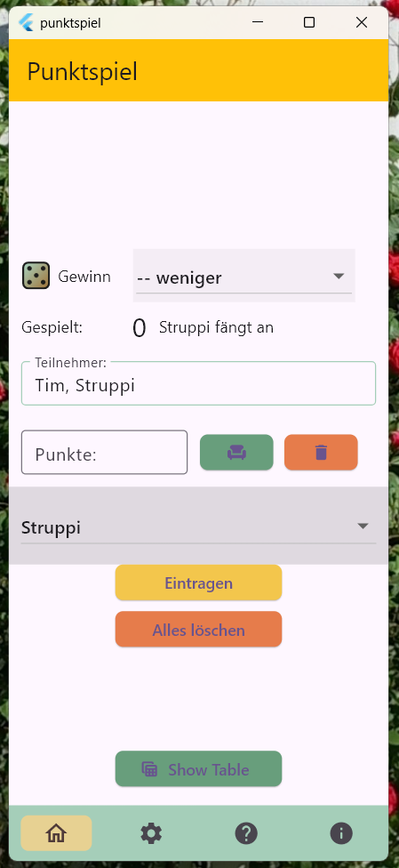

# punktspiel

A local app to add points when playing cards in a group.

Designed for the fun of it and for learning!

## Features
Entry field for player names, submit points, show results.

&nbsp;&nbsp;

## References

### Files
* Medium article: [Handling JSON files](https://medium.com/@dudhatkirtan/flutter-read-json-file-from-assets-guide-2024-a99f31d9c2a6)
* Importing assets: [Mediendateien importieren](https://www.flutter.de/artikel/flutter-assets-bilder-sound-verwenden)

### Widget types
<!--* Updatable tables (beta state?): [Dynamic table](https://pub.dev/packages/dynamic_table)-->
* Navigating:
  - MaterialApp vs. Scaffold: [fixing black screen issue](https://stackoverflow.com/questions/53723294/flutter-navigator-popcontext-returning-a-black-screen)

### Input fields
* Numbers: [Digits Only](https://stackoverflow.com/questions/49577781/how-to-create-number-input-field-in-flutter#49578197)
